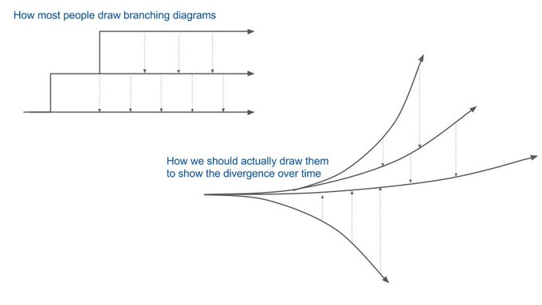

% branching strategy selector, part #1 (basic concepts)
% Marc Gonzalez-Carnicer (ERNI Barcelona)
% September 2021

---

objective

```
    Help YOU & your TEAM
    CHOOSE for your project
    a proper:
```

- (git?) workflow &
- branching strategy


---

HEY WAIT! what's this flow/BS stuff?

- is this a _self-help therapy_?
- do I really need a BS?
- can't I do without? (as usual)
- _how much_ does this cost?
- what do I get/avoid _in return_?


---

about this work

- part of my ERNI (career path) masterpiece
- something I wanted to know about
- performed guided search & read
- this presentation +
- ... detailed, in-depth document
- ... annotated bibliography
- ... BS selector tools

---


about me @ERNI

- joined ERNI as senior 4+ years ago
- worked for HP ever since
- printer FW developer (C++, linux)
- HP multiplatform library (C++)
- HP common platform developer (DUNE)


---

about me with VCSs (Version Control Systems)

- always been interested in VCSs, even when not available (no internet)
- happy to discover SCCS (GUI in sun's solaris), disgusted about Microsoft's SS
- very happy when found out about SVN (unlike Linus Torvalds)
- lucky to have never used CVS (worse than its simple predecessor RCS)
- DVCSs: tried Ubuntu's bzr (bazaar), though never tried mercurial (hg)
- tried git in the beginning, didn't understand anything
- tried git again when hype, and liked it so much, started to use it over SVN
- using git _officially_ only since May 2021


---

about me with VCSs #2

- 2005: convinced management (and colleagues) at my former company to:
- use SVN, and ...
- replace existing inferior solutions
- despite not being a _salesman_ (quite the opposite)


---

target audience

- managers (have the last word)
- product owners
- SW architects
- project managers
- agile masters?
- NOT FOR devops engineers (know more than me :) !)
- ... and developers


---

objective:

- showcase ERNI-services's BS selector
- provide _beginner level_ knowledge about BS & gWF and underlying, related concepts
- understand why they are (or not) useful
- help you decide if you need one (or not!), and the MOST suited
- decide with _awareness_ (not blindly or with inertia / prejudice)
- _humbly_ provide tips on using VCSs and BSs (I am sure you know or heard of most of the covered topics)


---

contents (general) (part #1, this session)

- ... only at introductory level (devops engineers know more than me!)
- definition of branching pattern, branching strategy, git workflow
- benefits (& costs) of gWF & BS
- basic concepts, featuring merge conflicts (solving vs minimizing)
- list of branching patterns
- list of branching strategies


---

contents, concepts determining which BS to choose (in part #2, next session)

- about integration of developers work
- about BS strategy
- related to deployment & releasing
- CI/CD (devops only?)
- testing & - error tolerance
- etc ... (some contents are self-provided)


---

# git workflows & branching strategies / patterns

---

abbreviations

* BS: Branching Strategy
* gWF: (git) WorkFlow -- not only with git!
* VCS: Version Control System (like svn, git, ...)
* D-VCS / DVCS: Distributed VCS (git, hg, bzr, ...)
* PR: pull request


---

about workflows and strategies

* a branching strategy (BS)  
* ... is part of a (git) workflow
* ... the most important one


---

branching patterns / branching strategies

* a branching pattern is a way of sharing/integrating developer changes
* a branching pattern is a way of managing the path to production / deployment
* a branching strategy is a set of branching patterns (maybe only 1)


---

git workflows and strategies

* conventions between developers
* rules to store, branch, merge changes
* rules to publish and deploy ...
* conventions may feel arbitrary, inappropiate ...


---

# benefits & costs of gWF & BS

---

now seriously, do I need one?

- are these BS just _hype_?
- you may not (who knows)
- will __most probably__ be useful
- ... and will save time & money
- __be careful!__ choosing _the wrong one_
- ... will be painful


---

git log chaos

{width=70% height=70%}


---

benefits (1)

- developers _do things_ the same way
- get rid of inconsistent practices
- avoid ill-defined workflows
- have a clean & sound log history (hygiene)
- no spaghetti-like / chaotic history


---

benefits (2)

- optimize productivity
- enable parallel development
- allow planned, structured releases
- have a clear path for SW changes through production


---

benefits (merging-related)

- avoid / minimize amount of _merge conflicts_
- minimize conflicts __complexity__
- reduce time when _publishing_


---

benefits (general)

```
    having a proper branching strategy
    => save 20%-40% in developer time

    choose a proper one
      in less than 1 hour
    (with this work)
```

Source: our own survey (mostly between ERNI developers)

---


cost

* more ceremony/bureaucracy for some operations (maybe)
* integration / release manager may be required (if none already)
* may need to train / educate developers
* developers may need some time to be adapt to it

---

git training

- even if people use layers above git (github/bitbucket/gitlab, Teams Foundation Server, gitflow plugins ...), it's convenient that the team is decently trained on raw git usage for the basic operations (pull, fetch, push, reset, merge, rebase, reflog, etc)

---

git training (join)

{width=70% height=70%}

---

# basic concepts

---

what is a commit?

- commits have different meanings / actions depending on the VCS
- in SVN: store + share + publish
- in git: store only
- git encourages committing often / svn not
- Seth Robertson: "Commit Often, Perfect Later, Publish Once: Git Best Practices"


---

what is a branch?

- different VCSs have different meanings or uses for a branch
- humans think of a branch as in a tree (bifurcation)
- in svn, a branch copies (cheaply) the files
- in git, a branch is simply a label of a history you don't want to lose, but it is not required to explicitly use them
- here, we'll use the _human_ meaning

{width=40% height=40%}

---

branching is easy, but ...

- in all VCSs, branching is easy
- integrating is the __tough__ part
- in SVN, _merging_ is not really efficient (design limitation)
- branching increases the complexity of your repository (Leroy principle)

{width=40% height=40%}

---

merge vs rebase vs cherry-pick

Reminder of these 2 ways of integrating changes.

- merge: join 2 branches with a new commit
- rebase: moves changes (replays) on a different base point from base branch
- cherry-pick: picks only 1 commit from 1 branch to another - may introduce conflicts (`git cherry` command may detect them)

{width=40% height=40%}

---


# merge conflicts

---

let's have a survey

- how often / when do you update/pull?
- how often / when do you commit/backup?
- how often / when do you share/publish (push)?
- answers on average - like every week / day / twice a day / 1-2 hours / several times an hour


---

updating too frequently?

- updating frequently helps reduce the complexity of merge conflicts
- but ... you get unexpected / potentially dangerous changes (not about build)
- lose the isolation of your feature branch development (unless some change is desired)

{width=55% height=55%}


---

probability of merge conflicts

- depends on:
- integration frequency
- codebase size
- location / distribution of tasks in the code


---

integration frequency

- difficult to quantificate (what does _frequent_ mean in terms of time?)
- how often shall we integrate changes?
- how many developers in the team? are there subteams?
- depends on several factors

---

codebase size

- size of your changes
- size of codebase
- ratio changes/codebase => merge conflict probability
- few changes compensate a low integration frequency


---

distribution of tasks in the code

- avoid (complex) merge conflicts, no matter how often integration is done or how large the codebase is by:
- try to be smart distributing the tasks
- make developers work on different locations (i.e. on a new feature / module)
- have the release manager (or the self-managed team) ensure people do not work on the same module / files

---

merge conflicts

---

sounds familiar?

{width=70% height=70%}

- in SVN you can't even commit if somebody has modified the same file (in a different place)
- in GIT you can't push without fetch/pull in the same branch

---

types of merge conflicts

- textual conflict
- painful textual conflict : many changes, impossible to process by diff viewers
- semantic conflict (NOT DETECTED - it builds!) : VERY DANGEROUS - example: rename method, other dev adds call to old method name

---

avoid banal merge conflicts

- reduce conflict occurrences and complexity by:
- enforce style before reviewing changes, so later on colleagues don't feel tempted to make unrelated changes fixing them
- write tidy code: EOL whitespace, indentation, TAB/blanks consistency, fileformat (DOS/unix), ... there are tools for that
- don't fix other colleagues unrelated changes => do that on a specific commit / also reducing code smells with tools like sonarqube


---

zero conflicts trick (only for you AMIGO)


{width=55% height=55%}


---

minimize merge conflicts

- commit/publish first the smallest / simplest change (less probability of hard to solve merge conflicts)
- the _zero conflicts trick_ should be intentionally avoided at all costs, may cause conflict panic
- _high-tech_ & _revolutionary_ trick: use your _soft skills_ and communicate (TALK!): before the commit, but also before developing the change
- use peer review to keep colleagues informed on what you have done (not only for reviewing the code)
- use agile meetings to inform / get informed about possible conflicts
- use the proper branching pattern accordingly


---

# branching patterns (integration)

---


Most relevant branching patterns related to integration (sharing developers work):

- mainline
- feature branch
- continuous integration
- collaboration branch
- experimental / future branch
- squash & merge (or rebase)


---

mainline integration

- no branches
- very simple
- everybody has used it some time
- in practice, it does not exist (every single sandbox is a branch by itself)


---

feature branch

- parallel, isolated development for a new feature
- variants: allow or not to update from main branch (usually not)
- variant: allow or not to break tests or even builds
- not a hotfix branch (later)

---

develop branch

- an integration branch to integrate all work before the mainline
- helps keep a healthy mainline
- adds complexity
- used by git-flow and other complex BS

---

continuous integration

- highly collaborative
- simulates developers are working on the same set of files / folders
- share / integrate continuously, any non build-breaking change
- reduces probability of merge conflicts, specially the tough ones
- variant: agree on being able to share code that breaks tests (even builds!)

---

team-integration branch

- allows a sub-team to integrate its changes before integrating with mainline
- provides a coherent and low-noise task delivery


---

collaboration branch

- useful for scoped continuous integration (share continously without disturbing the whole team)
- isolation from/to outer world when sharing on a sub-team (feature)


---

experimental / future branch

- branches that have no expectation of early release
- "future" may mean "very experimental", or for a far future
- does not create noise on mainline while doing extreme refactoring
- integration may be tough


---

squash & merge / rebase

- recent approach
- squash all commits into 1 before integrating into the mainline
- dramatically reduces / avoids log history chaos
- provides a clean (but isolated) mainline, but loses full history (partial commits & branch origin)
- also possible with rebase instead of merge (thus becoming a cherry-pick)
- popular and possible with the PRs of github, bitbucket, etc


---

# branching patterns (releasing)

---


Most relevant branching patterns related to releasing

- hotfix branch
- release branch
- maturity/stable branch
- release train, future / cascaded trains
- release-ready mainline


---

hotfix branch

- similar to feature branch (but triggered by users / testers)
- departs from production code, not mainline / develop
- is expected to be closed quickly ASAP


---

release branch

- a branch devoted to increase stability on a given product features
- does not accept _cool_ and new _features_, only bugfixes
- may cause merge conflicts when porting fixes to mainline (diverged?)


---

maturity/stable branch

- branch (or tag) with stable code (answers the _what is your latest stable release?_ question)
- to be given to testers, beta-testers, or install in production
- also as a stable point for developing new features _without unexpected bugs_


---

release train, future / cascaded trains

- commitment to release in fixed slots of time from the healthy mainline
- aims at not delaying too much releasing of new features
- its changes are also applied to the mainline (hopefully with automerge)
- there may be several cascaded _trains_ (April train, June train, ...), the latest one (June) feeding to the previous one (April), etc and the mainline


---

release-ready mainline

- commitment to always have a healthy mainline, ready for production/deployment at any time
- works better with an integration buffer below it (a _develop_/_integration_ branch)


---

# THE.BEST.ONE

---

what is the best one?

- some people just want to use the same BS always
- some people think a given BS is the best one, and suits all kind of projects
- so ... it depends! the ERNI BS selector comes in handy

---

Martin Fowler's opinion

- (I have quoted from his web page https://martinfowler.com/articles/branching-patterns.html)
- most influential developers (chief scientist at thoughtworks)
- book author (UML, refactoring, agile, ...) and board member of agile technologies
- advocated XP (eXtreme Programming) in the late '90s together with Kent Beck
- he strongly recommends to use _Continous Integration_ (simulate working on same set of files, sharing work / integrating very often) - reason: minimize merge conflicts
- I beg to humbly disagree with him: have used it only some times, depending on development phase
- when developing in feature branch, one does not want the _noise_ caused by other colleagues work


---

my opinion

* play as a team, being always consistent, without anarchy
* start with something simple (use BS selector)
* analyze if it works well, and if not, why
* be flexible: feel free to adapt / change if required (all together)

---


---

conclusion

- (define,) agree & use a branching strategy 
- choose the proper one with awareness, or use ERNI's selector if no time
- be open & ready to change / adapt
- to minimize merge conflicts, use agile (daily) meetings to inform of upcoming refactors & commits


---

thanks

- Martin Fowler, for the _branching patterns_ online article
- Oliver Widder, for the _geek & poke_ cartoons

- Juan Carlos Arco (ERNI Barcelona), my mentor, for endless help and lots, lots of patience with me
- Alberto Martin Casado (ERNI Madrid), for providing knowledge and guidance, allowing me to learn about this
- David Carmona (ERNI Barcelona), for technical help broadcasting

